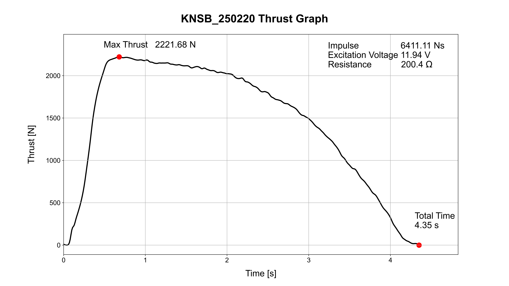
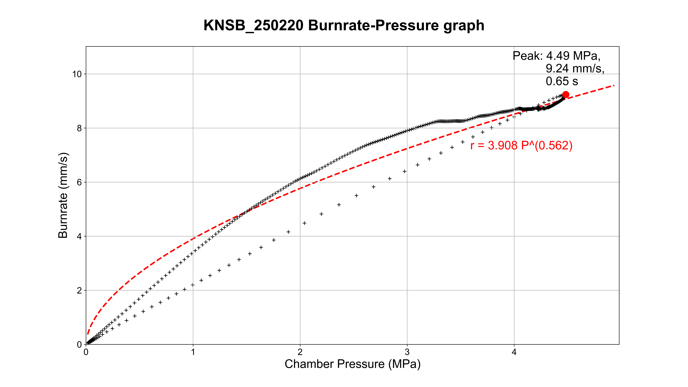

# HANARO SFT (Static-Fire Toolkit)


**HANARO SFT (Static-Fire Toolkit)** is an open-source command-line toolkit developed by the [Seoul National University Rocket Team **HANARO**](https://hanaro.snu.ac.kr/).  
It provides a standardized workflow for processing **static-fire test data** from amateur and research solid rocket motors, focusing on **data cleaning, performance analysis, burn rate estimation, and visualization**.

While the library can be imported in Python, the **initial releases focus on the CLI interface**, making it straightforward to use as a standalone tool in test workflows.

## Features
- **CLI-based workflow** — run analysis directly from the terminal  
- **Data processing** — clean and normalize raw thrust/pressure sensor logs  
- **Performance metrics** — compute impulse, burn time, chamber pressure statistics  
- **Burn rate estimation** — regression-based analysis for solid propellants  
- **Visualization** — generate thrust/pressure plots for reports and documentation  

## Requirements
- Python 3 (3.10+ required)
- Packages:
  - numpy (>=2.0)
  - scipy (>=1.13)
  - pandas (>=2.0)
  - matplotlib (>=3.10)
  - openpyxl (>=3.1)  # pandas read_excel engine

## Installation

From PyPI:

```bash
python3 -m pip install static-fire-toolkit
```

Or install from source:

```bash
git clone https://github.com/snu-hanaro/static-fire-toolkit.git
cd static-fire-toolkit
python3 -m pip install -e .
```

## Usage

### Required Directory Layout

```sh
root/                        # run sft here (or specify this path using the --root option)
├─ global_config.xlsx        # global configs, optional
├─ config.xlsx               # per-test configs, required
├─ data/
│  ├─ _pressure_raw/         # input pressure raw CSVs
│  └─ _thrust_raw/           # input thrust raw CSVs
├─ results/
│  ├─ burnrate/              # calculated burnrate CSVs
│  ├─ burnrate_graph/        # burnrate PNG/GIF plots
│  ├─ pressure/              # processed pressure CSVs
│  ├─ pressure_graph/        # pressure PNG plots
│  ├─ thrust/                # processed thrust CSVs
│  └─ thrust_graph/          # thrust PNG plots
└─ logs/                     # logs for debugging
```

All commands assume the root contains `data/_pressure_raw`, `data/_thrust_raw`, and `config.xlsx`.

### CLI
Basic workflow (see `examples/` for a runnable set):

```bash
# End-to-end: thrust -> pressure -> burnrate
sft [--root <path>] process [--expt <expt_file_name>]  # e.g. sft --root examples process [--expt KNSB_250220]

# Stage-by-stage
sft [--root <path>] thrust [--expt <expt_file_name>]  # e.g. sft --root examples thrust --expt KNSB_250220
sft [--root <path>] pressure [--expt <expt_file_name>]  # e.g. sft --root examples pressure --expt KNSB_250220
sft [--root <path>] burnrate [--expt <expt_file_name>]  # e.g. sft --root examples burnrate --expt KNSB_250220
```

Run `sft --help` and `sft [--root <path>] info` for more details.

#### Examples from this repo:
- Input samples: [examples/data/_thrust_raw/](./examples/data/_thrust_raw/), [examples/data/_pressure_raw/](./examples/data/_pressure_raw/), [examples/config.xlsx](./examples/config.xlsx)
- Output samples: [examples/results/thrust/](./examples/results/thrust/), [examples/results/pressure/](./examples/results/pressure/), [examples/results/burnrate/](./examples/results/burnrate/)

#### Output preview (from `examples/`):







### Global Configuration: `global_config.py`

### Per-Test Configuration: `config.xlsx`
Record one row per test; the latest row is processed by default. Required columns:

| Column | Description | Example |
| :--- | :--- | :--- |
| index | Zero-based test index	| 17 |
| date | Date in YYMMDD | 250220 |
| type | Propellant type | KNSB |
| expt_file_name | Experiment base name | KNSB_250220 |
| expt_input_voltage [V] | DAQ input voltage | 11.94 |
| expt_resistance [Ohm] | DAQ potentiometer resistance | 200.4 |
| totalmass [g] | Propellant total mass | 4996.3 |
| Nozzlediameter [mm] | Throat diameter | 20 |
| Outerdiameter [mm] | Grain OD | 90 |
| Innerdiameter [mm] | Grain ID | 30 |
| singlegrainheight [mm] | Single grain height | 104.5 |
| segment | Grain count | 5 |

> [!NOTE]
> `expt_file_name` (if present) is auto-filled based on the values of date and type — do not edit. Notes/remarks are optional.

### Data I/O Format & Processing Pipeline
- **Inputs**:
  - Raw Thrust Data: CSV
  - Raw Pressure Data: CSV
- **Outputs**:
  - Uniform-step processed CSVs at Δt = 1/`frequency` s: `time` + `thrust [N]` or `pressure [bar]`
  - PNG plots of thrust and pressure curves
- **Filtering**:
  - Thrust → low-pass filter + Gaussian smoothing
  - Pressure → no filter (typically smooth enough)
- **Pressure Normalization**: adjust for local vs. standard atmospheric pressure at test time
- **Config**: `config.xlsx` stores test conditions (date/nozzle/grain, etc.)

> [!NOTE]
> **File-Naming Summary**:
> - Thrust raw: `TYPE_YYMMDD_thrust_raw.csv`
> - Thrust outputs: `TYPE_YYMMDD_thrust.csv`, `TYPE_YYMMDD_thrust.png`
> - Pressure raw: `TYPE_YYMMDD_pressure_raw.csv`
> - Pressure outputs: `TYPE_YYMMDD_pressure.csv`, `TYPE_YYMMDD_pressure.png`

### Thrust Data Processing
#### Thrust raw (`data/_thrust_raw/`)
- Filename: `TYPE_YYMMDD_thrust_raw.csv` (e.g., `KNSB_250220_thrust_raw.csv`)
- Default Format: comma-separated, 2 columns, with column labels (Configurable via [`global_config.py`](#global-configuration-global_configpy))
	1. time (s)
  2. voltage (V) (should be 1:1 to thrust)
- Important: treat raw CSV as read-only. Re-saving in third-party editor such as Excel may change encoding/separators.

Example (excerpt):

```csv
246.42052460007835,1.34765625
246.42483200004790,1.455078125
```

#### Pipeline
1. Read the latest test row from `config.xlsx`
2. Load the matching raw thrust CSV from `_thrust_raw/`
3. Extract combustion window; handle spikes/outliers
4. PCHIP interpolation to Δt = 1/`frequency` s
5. Apply low-pass + Gaussian filters
6. Save processed thrust CSV → `results/thrust/TYPE_YYMMDD_thrust.csv`
7. Save thrust plot PNG → `results/thrust_graph/TYPE_YYMMDD_thrust.png`

#### Output CSV schema

| time [s] | thrust [N] |
| :--- | :--- |
| 0.00 | 2.757… |
| 0.01 | 16.772… |
| 0.02 | 32.070… |
| … | … |

### Pressure Data Processing
#### Pressure raw (`data/_pressure_raw/`)
- Filename: `TYPE_YYMMDD_pressure_raw.csv`
- Default Format: comma-separated, 2 columns, with column labels (Configurable via [`global_config.py`](#global-configuration-global_configpy))
  1. Datetime ([ISO 8601](https://www.iso.org/iso-8601-date-and-time-format.html) format recommended, not necessarily in exactly the same format. For more details, see the [`pandas.to_datetime` documentation](https://pandas.pydata.org/docs/reference/api/pandas.to_datetime.html).)
  2. Pressure (Bar)

Example (header + excerpt):

```csv
Datetime,Pressure (Bar)
2025.2.20 22:34,1.159
2025.2.20 22:34,1.132
```

#### Pipeline
1. Read the latest test row from config.xlsx
2. Load the matching raw pressure CSV from `_pressure_raw/`
3. Load the processed thrust CSV to synchronize burn window
4. PCHIP interpolation to Δt = 1/`frequency` s
5. Atmospheric correction: adjust for local vs. standard atmospheric pressure at test time
6. No filtering (pressure changes are typically smooth)
7. Save processed pressure CSV → `results/pressure/TYPE_YYMMDD_pressure.csv`
8. Save pressure plot PNG → `results/pressure_graph/TYPE_YYMMDD_pressure.png`

#### Output CSV schema

| time [s] | pressure [bar] |
| :--- | :--- |
| 0.00 | 1.447… |
| 0.01 | 1.500… |
| 0.02 | 1.560… |
| … | … |

## Troubleshooting & Best Practices
- Do not edit raw CSVs. Excel re-save can alter encoding/delimiters → corrupted data. Keep raw files read-only.
- Configure your `global_config.py` and `config.xlsx` correctly.
- “Latest row” logic. The CLI processes the most recent test by default. To reprocess an older test, update `config.xlsx` or pass `--expt`. We plan to add batch processing feature in a future release.
- Debugging order: follow the stage order — load → windowing → interpolation → filters → correction → save. Most issues are path/filename mismatches, delimiter/headers, or NaNs from partial rows.
- Reproducibility: do not overwrite raw CSVs; version `config.xlsx`; keep outputs auto-versioned by type/date in filenames.

### How to Report Issues
If you encounter a problem, please open an issue with:
- The output of `sft info --root <your-root>` (environment and package details)
- The corresponding logs in the `logs/` directory
- If possible, a minimal sample (subset of `data/_thrust_raw`, `data/_pressure_raw`, and `config.xlsx`) that reproduces the issue

## FAQ
### Q1. Why filter thrust but not pressure?
Thrust often contains transient spikes/noise (mechanical shocks, DAQ artifacts), so smoothing helps. Pressure changes are typically gradual; avoiding filters prevents distortion of real variations.

### Q2. What does the pressure correction do?
It compensates for the difference between local atmospheric pressure at test time and standard atmosphere, enabling apples-to-apples comparisons across sessions.

## Development

### Tools used
- Ruff: linting & formatting
- pytest: testing
- coverage: test coverage reports
- pre-commit — enforce style checks before commits
- GitHub Actions — CI/CD (matrix testing across Python 3.9–3.13)

### Local setup

```bash
# Run linting
ruff check .
ruff format .

# Run tests
pytest -q
```

### CI/CD Strategy
- Branching: trunk-based development (main protected)
- Matrix testing: Python 3.10–3.13, both latest and [minimum dependencies](constraints-min.txt)
- Tags:
  - Signed tags by default
  - Annotated tags allowed with --no-sign
  - Structured tag messages including Summary / Highlights / Breaking / Fixes / Docs / Thanks / Artifacts

## Contributing

Please use Issues/PRs with templates. Recommended:
- Feature request & bug report templates
- Code style (e.g., black, ruff) & type hints
- Sample data policy (strip sensitive metadata)

## Author & Maintainers
- Author: Seoul National University Rocket Team HANARO
- Maintainer: [@yunseo-kim](https://github.com/yunseo-kim)

## License

This project is licensed under the [MIT License](/LICENSE).
